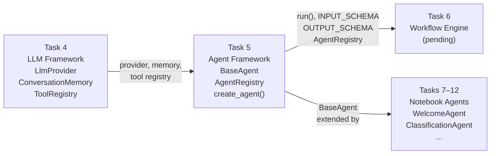
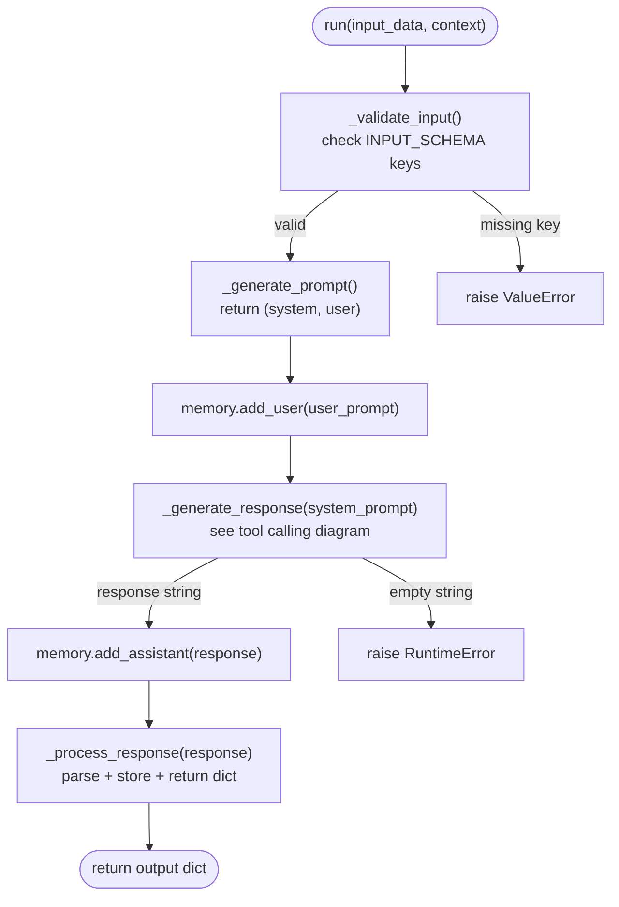
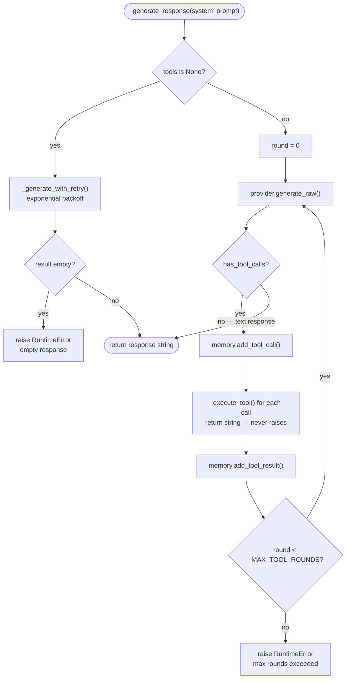

# Subtask 5.7 — Architecture Documentation

## Context

Subtask 5.7 produces the architecture document for the agent framework and
completes Task 5. It is the reference that Tasks 6–12 and the workflow engine
will use to understand agent contracts without reading the source code.

**Prior subtask (5.6):** 55 tests passing (53 mocked + 2 live), confirming
all agent framework behaviour is correct and stable.

**Next (Task 6 — workflow engine):** Needs the `INPUT_SCHEMA`/`OUTPUT_SCHEMA`
contract, `AgentRegistry` API, and `run()` signature documented so it can chain
agents without inspecting implementation.

---

## Dependencies

- Subtasks 5.1–5.6 all marked done in `tasks.json`
- `core/agents/base_agent.py`, `simple_agent.py`, `utils.py`, `__init__.py` fully implemented
- `tests/unit/test_agents.py` passing (55/55)

---

## Files to Modify / Create

| File | Action | Summary |
|------|--------|---------|
| `docs/Architecture/architecture-agent-framework.md` | Create | Full architecture doc — 9 sections + 3 Mermaid diagrams |
| `README.md` | Modify | Add agent framework row to architecture table; update test count and coverage table; update project structure |
| `core/__init__.py` | Modify | Add `RestaurantInfoAgent`, `AgentRegistry`, `create_agent` imports and `__all__` entries |

---

## Design Decisions

### Decision 1: Add Mermaid diagrams — break from existing convention where it adds real value

**Choice:** Include Mermaid flowcharts for the three sections where a diagram
replaces two or more paragraphs of prose: stack position, `run()` lifecycle,
and the tool calling loop.

**Rationale:** The existing architecture docs use text, tables, and code snippets
only. The agent framework introduces the first cyclic flow in the codebase (the
tool calling loop), which is genuinely hard to understand from prose alone.
Mermaid is text-based, version-controllable, and renders natively in GitHub
and most editors — the same benefits as the existing text format, plus
visual clarity where the structure is non-linear.

---

### Decision 2: Document what is built, not what is planned

**Choice:** All content in the architecture doc describes the current
implementation exactly. No speculative or forward-looking content, except
the explicit deferral note for external frameworks (which is a confirmed
architectural decision, not speculation).

**Rationale:** Speculative content misleads future implementers who treat
the doc as a source of truth.

---

### Decision 3: Note the `max_retries=0` edge case in the error handling section

**Choice:** Add a brief note in the Error Handling section about the
`_generate_with_retry()` return type imprecision for `max_retries=0`.

**Rationale:** This was flagged as an open suggestion during subtask 5.6
validation (persisted to parent task plan). The architecture doc is the
right place to document it as a known limitation; adding the guard is
out of scope for this subtask.

---

## Architecture Document — Section Specification

### Section 1: Overview

One paragraph: where the agent layer sits in the stack.
Follow with the stack position Mermaid diagram (see Diagrams section).
Then a one-line description of what each layer provides.

---

### Section 2: BaseAgent class

Table of instance fields:

| Field | Type | Default | Purpose |
|-------|------|---------|---------|
| `name` | `str` | required | identifier used in errors and storage keys |
| `provider` | `LlmProvider` | required | LLM provider (OpenAI or Claude) |
| `memory` | `ConversationMemory` | `ConversationMemory()` | conversation history |
| `tools` | `ToolRegistry | None` | `None` | tool registry for function calling |
| `_data_store` | `dict[str, Any]` | `{}` | structured business data |

Table of class-level attributes (ClassVar — not dataclass fields):

| Attribute | Type | Default | Purpose |
|-----------|------|---------|---------|
| `INPUT_SCHEMA` | `dict[str, str]` | `{}` | keys required in `input_data` |
| `OUTPUT_SCHEMA` | `dict[str, str]` | `{}` | keys the agent returns |
| `RESPONSE_MODEL` | `type[BaseModel] | None` | `None` | Pydantic model for structured output |
| `_MAX_TOOL_ROUNDS` | `int` | `10` | max tool call iterations per `run()` |

Abstract methods subclasses must implement:
- `_generate_prompt(input_data, context) -> tuple[str, str]`
- `_process_response(response) -> dict[str, Any]`

---

### Section 3: Input/output contract

How schemas are defined:
```python
class WelcomeAgent(BaseAgent):
    INPUT_SCHEMA = {"user_message": "A message from the operator."}
    OUTPUT_SCHEMA = {"restaurant_name": "Extracted name or None.",
                     "restaurant_type": "Extracted type or None."}
```

How `_validate_input()` enforces them:
- Raises `ValueError` with agent name and missing keys before any API call
- Extra keys in `input_data` are silently accepted
- `INPUT_SCHEMA = {}` disables validation

How Task 6 uses them: reads `INPUT_SCHEMA` to know what to pass; reads
`OUTPUT_SCHEMA` to know what to extract and pass to the next step.

---

### Section 4: Tool calling mechanism

Include the tool calling loop Mermaid diagram (see Diagrams section).
Then describe:
- `register_tool()` auto-creates `ToolRegistry` if `tools=None`
- `_execute_tool()` always returns a string — never raises; errors are
  returned as descriptive strings for the LLM to handle
- `_MAX_TOOL_ROUNDS` guard: raises `RuntimeError` after 10 iterations
  without a final text response

Error string format:
- Unknown tool: `"Error: tool '<name>' not registered."`
- Tool raises: `"Error executing '<name>': <exception>"`

---

### Section 5: Memory and state

Distinction table:

| Type | Class | Scope | Persisted by |
|------|-------|-------|--------------|
| Conversation memory | `ConversationMemory` | LLM message context | `save_state()` |
| Agent data store | `dict` (`_data_store`) | Structured business data | `save_state()` |

Key rules:
- `reset_memory()` clears only `ConversationMemory`; store untouched
- `clear_store()` clears only `_data_store`; memory untouched
- `save_state(data_lake, session_id=...)` persists both together
- `load_state(data_lake, session_id=...)` restores both; no-op for unknown session_id
- Use `store()`/`retrieve()` inside `_process_response()` to persist extracted data

---

### Section 6: Error handling

Error strategy table:

| Error type | Strategy |
|------------|----------|
| Missing required input key | `ValueError` raised immediately (before any API call) |
| LLM API rate limit / timeout / connection | Retry up to 3 times, exponential backoff (1s → 2s → 4s) |
| LLM returns empty string | `RuntimeError` with agent name |
| Tool not found | Return error string to LLM (no exception) |
| Tool execution raises | Return error string to LLM (no exception) |
| Malformed JSON response | `_parse_response()` returns `{}`; caller handles |
| DataLake error on save/load | Exception propagates — state persistence failure is hard |
| `max_retries` exhausted | Final provider exception re-raised to caller |

Retry classification: `_is_retryable()` checks `type(exc).__name__` against
a `frozenset` of known retryable class names — covers both `anthropic` and
`openai` SDK error hierarchies without importing either.

Retryable names: `RateLimitError`, `APITimeoutError`, `APIConnectionError`,
`ServiceUnavailableError`, `InternalServerError`, `Timeout`, `ConnectionError`.

**Known limitation:** `_generate_with_retry()` is annotated `-> str` but
implicitly returns `None` if called with `max_retries=0` (empty `range`).
The call site always uses the default of 3. A defensive guard
(`if max_retries < 1: raise ValueError`) has not been added yet.

---

### Section 7: How to implement a concrete agent

Step-by-step with code:

```python
from core.agents.base_agent import BaseAgent
from typing import Any, ClassVar
from pydantic import BaseModel  # optional

class _MyResponse(BaseModel):  # optional — enables structured output
    field_a: str | None = None
    field_b: str | None = None

class MyAgent(BaseAgent):
    # 1. Declare schemas
    INPUT_SCHEMA: ClassVar[dict[str, str]] = {
        "user_message": "Description of expected input.",
    }
    OUTPUT_SCHEMA: ClassVar[dict[str, str]] = {
        "field_a": "Extracted value or None.",
        "field_b": "Extracted value or None.",
        "raw_response": "Full LLM response string.",
    }
    RESPONSE_MODEL: ClassVar[type[BaseModel] | None] = _MyResponse  # or None

    # 2. Build prompts
    def _generate_prompt(
        self, input_data: dict[str, Any], context: dict[str, Any]
    ) -> tuple[str, str]:
        return "System prompt here.", input_data["user_message"]

    # 3. Parse response
    def _process_response(self, response: str) -> dict[str, Any]:
        data = self._parse_response(response)      # handles JSON + Pydantic
        self.store("field_a", data.get("field_a")) # persist to data store
        return {
            "field_a": data.get("field_a"),
            "field_b": data.get("field_b"),
            "raw_response": response,
        }
```

Rules to follow:
- Always define `INPUT_SCHEMA` and `OUTPUT_SCHEMA` — Task 6 requires them
- `_generate_prompt()` must return a 2-tuple `(system, user)` — never merged
- Use `self._parse_response()` not `parse_structured_output()` directly — handles Pydantic validation
- Use `self.store()` to persist data extracted during the conversation
- Do not call `self.memory.add_user()` or `self.memory.add_assistant()` — `run()` manages memory

---

### Section 8: Integration with Task 6 (workflow engine)

What Task 6 relies on:

| Contract | How Task 6 uses it |
|----------|--------------------|
| `run(input_data=..., context=...)` | Calls each agent in sequence; passes context from prior step |
| `INPUT_SCHEMA` | Knows what keys to pass to each agent |
| `OUTPUT_SCHEMA` | Knows what keys to extract and forward to the next agent |
| `AgentRegistry` | Looks up agents by name; `registry.get("welcome-agent")` |
| `create_agent()` | Factory for constructing agents with a shared provider |

Agents must not break these contracts. Adding keys to `OUTPUT_SCHEMA` is
backwards-compatible; removing keys is not.

---

### Section 9: Deferred — external framework integration

Copy verbatim from the parent task-5 plan's "Note on External Frameworks" section.
Do not paraphrase — this is a recorded architectural decision.

---

## Diagrams

### Diagram 1: Stack position (Section 1)



---

### Diagram 2: run() lifecycle (Section 2 or Section 3)



---

### Diagram 3: Tool calling loop (Section 4)



---

## README Updates

### Architecture table — add row

After the persistence row, add:
```
| Agent framework (BaseAgent, tool calling, memory, state, retry) | [architecture-agent-framework.md](docs/Architecture/architecture-agent-framework.md) |
```

### Test count comment — update

Line reading `# Run all unit tests (394 tests)` → `# Run all unit tests (462 tests)`

### Test coverage table — add row and correct total

Add after the Memory row:
```
| Agent framework | 55 | BaseAgent lifecycle, tool calling, state, retry, RestaurantInfoAgent |
```
Update the Total row: `407` → `462`, `100% core coverage` stays.

### Project structure block — add `core/agents/`

Inside the `core/` block, add:
```
│   ├── agents/
│   │   ├── __init__.py
│   │   ├── base_agent.py        # BaseAgent abstract class
│   │   ├── simple_agent.py      # RestaurantInfoAgent (framework validation)
│   │   └── utils.py             # create_agent(), AgentRegistry, retry helpers
```

---

## core/__init__.py Update

**Change line 109** from:
```python
from core.agents.base_agent import BaseAgent
```
To:
```python
from core.agents import BaseAgent, RestaurantInfoAgent, create_agent, AgentRegistry
```

**Add to `__all__`** under the `# agents` comment:
```python
    # agents
    "BaseAgent",
    "RestaurantInfoAgent",
    "create_agent",
    "AgentRegistry",
```

---

## Out of Scope

- Adding the `max_retries=0` guard to `base_agent.py` (doc note only)
- Architecture docs for any module other than the agent framework
- Any changes to `core/agents/` source files
- Task 6 implementation
- Gradio UI or notebook integration

---

## Risks and Open Questions

1. **README project structure is significantly stale.** The `core/` block
   still shows the old flat layout without `ai/`, `domain/`, `operations/`,
   `storage/`, or `agents/` subdirectories. The plan scopes only adding
   `core/agents/` — fixing the full structure is out of scope but noted
   so a reviewer can challenge this boundary if needed.

2. **Mermaid rendering is environment-dependent.** Mermaid renders in
   GitHub, Notion, and VS Code with extensions, but not in plain terminal
   `cat`. If the team reviews docs outside those environments, diagrams
   will appear as raw code blocks. No action needed now — note it.

### [OPEN] — "Live Tests" README row does not reflect agent live tests after 5.7
**Source:** Validation of subtask 5.7
**Problem:** The README coverage table has a cross-module "Live Tests | 13" row for LLM provider live tests. Subtask 5.6 added 2 agent live tests (`TestLiveRestaurantInfoAgent`). The plan adds "Agent framework | 55" (which includes the 2 live tests) but does not update "Live Tests | 13" to 15. After 5.7, total live tests in the suite are 15 but the README still shows 13.
**Impact:** Live test count in the README is misleading. Anyone running only the live tests with `-k Live` will see 15 run, not 13.
**Suggested action:** During implementation, decide: either update "Live Tests" row from 13 → 15 (and note in the agent framework row description that it includes 53 mocked + 2 live), or accept that "Live Tests" tracks only provider-level live tests and add a note clarifying the distinction.

---

## Deliverable Checklist

### `docs/Architecture/architecture-agent-framework.md`
- [ ] Created at correct path
- [ ] Section 1: Overview with stack position Mermaid diagram
- [ ] Section 2: BaseAgent class — fields table, ClassVar table, abstract methods
- [ ] Section 3: Input/output contract — schema definition, validation rules, Task 6 usage
- [ ] Section 4: Tool calling mechanism with loop Mermaid diagram
- [ ] Section 5: Memory and state — distinction table, key rules
- [ ] Section 6: Error handling — strategy table, retry classification, `max_retries=0` note
- [ ] Section 7: How to implement a concrete agent — step-by-step with full code example
- [ ] Section 8: Integration with Task 6 — contract table
- [ ] Section 9: Deferred external framework integration — verbatim from parent plan

### `README.md`
- [ ] Agent framework row added to architecture table
- [ ] Test count comment updated to 462
- [ ] Agent framework row added to test coverage table; total updated to 462
- [ ] `core/agents/` block added to project structure

### `core/__init__.py`
- [ ] `RestaurantInfoAgent`, `create_agent`, `AgentRegistry` imported from `core.agents`
- [ ] All four agent symbols in `__all__`
- [ ] `from core import AgentRegistry, create_agent, RestaurantInfoAgent` works without error
