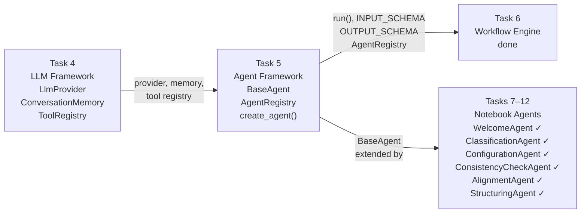
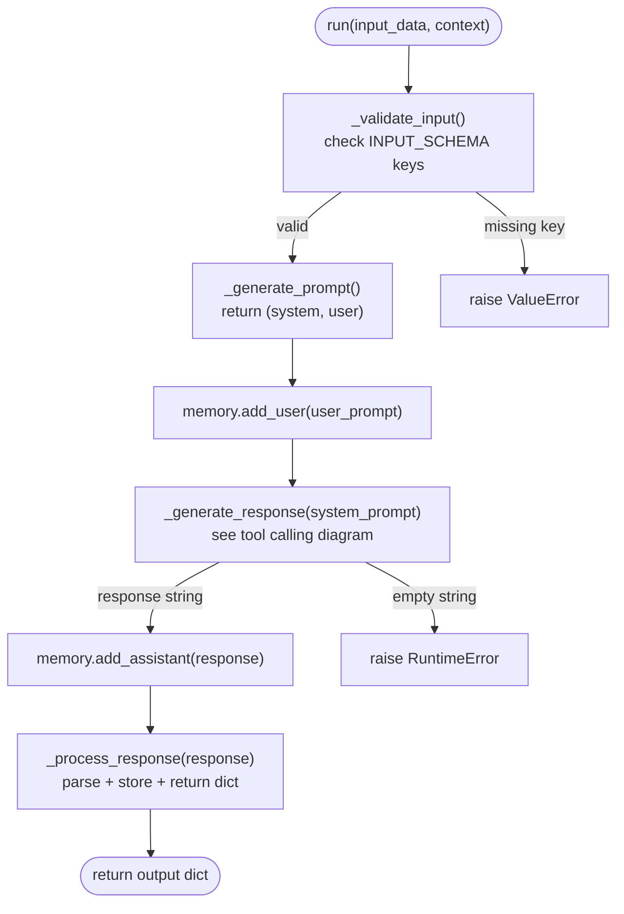
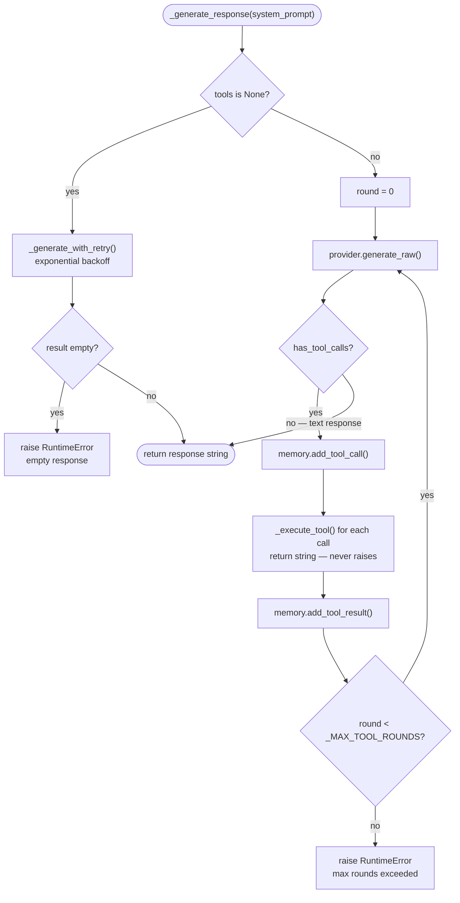

# Agent Framework Architecture

## 1. Overview

The agent framework (Task 5) sits between the LLM framework (Task 4) and the workflow
engine (Task 6). It provides the abstract base class, tool calling loop, memory and state
management, and retry logic that every notebook agent inherits. Task 6 chains agents by
reading their input/output contracts; Tasks 7–12 provide the concrete agents.



| Layer | Provides |
|-------|----------|
| Task 4 — LLM Framework | `LlmProvider`, `ConversationMemory`, `ToolRegistry` |
| Task 5 — Agent Framework | `BaseAgent`, `AgentRegistry`, `create_agent()` |
| Task 6 — Workflow Engine | Pipeline orchestration (done) |
| Tasks 7–12 — Notebook Agents | Concrete agents extending `BaseAgent` (`WelcomeAgent` ✓, `ClassificationAgent` ✓, `ConfigurationAgent` ✓, `ConsistencyCheckAgent` ✓, `AlignmentAgent` ✓, `StructuringAgent` ✓; Task 12 pending) |

---

## 2. BaseAgent class

`BaseAgent` is an abstract dataclass in `core/agents/base_agent.py`. All concrete agents
extend it and implement two abstract methods.

### Instance fields (dataclass fields)

| Field | Type | Default | Purpose |
|-------|------|---------|---------|
| `name` | `str` | required | Identifier used in errors and storage keys |
| `provider` | `LlmProvider` | required | LLM provider (OpenAI or Claude) |
| `memory` | `ConversationMemory` | `ConversationMemory()` | Conversation history |
| `tools` | `ToolRegistry \| None` | `None` | Tool registry for function calling |
| `_data_store` | `dict[str, Any]` | `{}` | Structured business data extracted during conversation |

### Class-level attributes (ClassVar — not dataclass fields)

| Attribute | Type | Default | Purpose |
|-----------|------|---------|---------|
| `INPUT_SCHEMA` | `dict[str, str]` | `{}` | Keys required in `input_data` |
| `OUTPUT_SCHEMA` | `dict[str, str]` | `{}` | Keys the agent returns |
| `RESPONSE_MODEL` | `type[BaseModel] \| None` | `None` | Pydantic model for structured output |
| `_MAX_TOOL_ROUNDS` | `int` | `10` | Max tool call iterations per `run()` |

### Abstract methods (subclasses must implement)

- `_generate_prompt(input_data, context) -> tuple[str, str]`
- `_process_response(response) -> dict[str, Any]`

### run() lifecycle



---

## 3. Input/output contract

Every agent declares its interface using two class-level schema dicts:

```python
class WelcomeAgent(BaseAgent):
    INPUT_SCHEMA  = {"user_message": "A message from the restaurant operator."}
    OUTPUT_SCHEMA = {"reply": "The agent's conversational response in Spanish.",
                     "raw_response": "Full LLM response string (same as reply)."}
    RESPONSE_MODEL = None  # plain prose — no structured output
```

### Validation rules

`_validate_input()` is called at the start of `run()` before any API call:

- Raises `ValueError` with the agent name and the list of missing keys if any
  `INPUT_SCHEMA` key is absent from `input_data`.
- Extra keys in `input_data` beyond those declared in `INPUT_SCHEMA` are silently accepted.
- `INPUT_SCHEMA = {}` disables validation entirely — all inputs accepted.

### How Task 6 uses the schemas

| Schema | Task 6 usage |
|--------|-------------|
| `INPUT_SCHEMA` | Knows what keys to pass to each agent |
| `OUTPUT_SCHEMA` | Knows what keys to extract and forward to the next agent |

---

## 4. Tool calling mechanism

When `self.tools` is set, `_generate_response()` runs a multi-turn loop via
`provider.generate_raw()` instead of the single-call retry path.



### Tool registration

`register_tool()` auto-creates a `ToolRegistry` if `self.tools is None`. Subsequent calls
reuse the same registry. This means an agent can be initialized without a registry and tools
added lazily.

### Tool execution

`_execute_tool()` always returns a string — it never raises. Errors are returned as
descriptive strings so the LLM can read them and decide how to proceed:

| Condition | Return value |
|-----------|-------------|
| Unknown tool | `"Error: tool '<name>' not registered."` |
| Tool function raises | `"Error executing '<name>': <exception>"` |
| Success | `str(result)` |

### _MAX_TOOL_ROUNDS guard

After `_MAX_TOOL_ROUNDS` (10) iterations without a final text response, `_generate_response()`
raises `RuntimeError` with the agent name and the round limit. This prevents infinite loops
when a model repeatedly calls tools without converging to a text answer.

---

## 5. Memory and state

`BaseAgent` maintains two independent storage areas:

| Type | Class | Scope | Persisted by |
|------|-------|-------|-------------|
| Conversation memory | `ConversationMemory` | LLM message context | `save_state()` |
| Agent data store | `dict` (`_data_store`) | Structured business data | `save_state()` |

### Key rules

- `reset_memory()` clears only `ConversationMemory`; the data store is untouched.
- `clear_store()` clears only `_data_store`; conversation memory is untouched.
- `save_state(data_lake, session_id=...)` persists both together under the same key.
- `load_state(data_lake, session_id=...)` restores both; no-op for an unknown `session_id`.
- Use `store(key, value)` / `retrieve(key, default)` inside `_process_response()` to persist
  extracted data across calls without re-parsing.

---

## 6. Error handling

| Error type | Strategy |
|------------|----------|
| Missing required input key | `ValueError` raised immediately (before any API call) |
| LLM API rate limit / timeout / connection | Retry up to 3 times, exponential backoff (1 s → 2 s → 4 s) |
| LLM returns empty string | `RuntimeError` with agent name |
| Tool not found | Return error string to LLM (no exception) |
| Tool execution raises | Return error string to LLM (no exception) |
| Malformed JSON response | `_parse_response()` returns `{}`; caller handles |
| DataLake error on save/load | Exception propagates — state persistence failure is fatal |
| `max_retries` exhausted | Final provider exception re-raised to caller |

### Retry classification

`_is_retryable()` (in `core/agents/utils.py`) checks `type(exc).__name__` against a
`frozenset` of known retryable class names. This covers both `anthropic` and `openai` SDK
error hierarchies without importing either SDK.

Retryable names: `RateLimitError`, `APITimeoutError`, `APIConnectionError`,
`ServiceUnavailableError`, `InternalServerError`, `Timeout`, `ConnectionError`.

### Known limitation

`_generate_with_retry()` is annotated `-> str` but implicitly returns `None` if called with
`max_retries=0` (the `for` loop over `range(0)` never executes). The call site always uses
the default of 3, so this is not a runtime risk today. A defensive guard
(`if max_retries < 1: raise ValueError`) has not been added yet.

---

## 7. How to implement a concrete agent

```python
from core.agents.base_agent import BaseAgent
from typing import Any, ClassVar
from pydantic import BaseModel  # optional


class _MyResponse(BaseModel):  # optional — enables structured output
    field_a: str | None = None
    field_b: str | None = None


class MyAgent(BaseAgent):
    # 1. Declare schemas
    INPUT_SCHEMA: ClassVar[dict[str, str]] = {
        "user_message": "Description of expected input.",
    }
    OUTPUT_SCHEMA: ClassVar[dict[str, str]] = {
        "field_a": "Extracted value or None.",
        "field_b": "Extracted value or None.",
        "raw_response": "Full LLM response string.",
    }
    RESPONSE_MODEL: ClassVar[type[BaseModel] | None] = _MyResponse  # or None

    # 2. Build prompts
    def _generate_prompt(
        self, input_data: dict[str, Any], context: dict[str, Any]
    ) -> tuple[str, str]:
        return "System prompt here.", input_data["user_message"]

    # 3. Parse response
    def _process_response(self, response: str) -> dict[str, Any]:
        data = self._parse_response(response)      # handles JSON + Pydantic
        self.store("field_a", data.get("field_a")) # persist to data store
        return {
            "field_a": data.get("field_a"),
            "field_b": data.get("field_b"),
            "raw_response": response,
        }
```

### Plain-text agent pattern (`RESPONSE_MODEL = None`)

For companion agents that return natural language prose (not structured JSON), skip
`_parse_response()` entirely:

```python
class WelcomeAgent(BaseAgent):
    RESPONSE_MODEL = None  # disables structured output at the provider level

    def _process_response(self, response: str) -> dict[str, Any]:
        return {"reply": response, "raw_response": response}
        # No _parse_response() call — response is plain prose
```

Setting `RESPONSE_MODEL = None` causes `_generate_response()` to pass
`structured_output=False` to the provider automatically — no JSON-forcing instruction
is appended to the prompt.

### Rules

- Always define `INPUT_SCHEMA` and `OUTPUT_SCHEMA`.
- `_generate_prompt()` must return a 2-tuple `(system, user)` — never merge them into one string.
- For structured output: use `self._parse_response()`, not `parse_structured_output()` directly.
- For plain-text output: set `RESPONSE_MODEL = None` and return the raw response string directly.
- Use `self.store()` to persist data extracted during the conversation.
- Do not call `self.memory.add_user()` or `self.memory.add_assistant()` — `run()` manages memory.

---

## 8. Integration with the workflow engine (Task 6 — done)

Task 6 chains agents in sequence using the contracts the agent framework exposes:

| Contract | How Task 6 uses it |
|----------|-------------------|
| `run(input_data=..., context=...)` | Calls each agent in sequence; passes context from the prior step |
| `INPUT_SCHEMA` | Knows what keys to pass to each agent |
| `OUTPUT_SCHEMA` | Knows what keys to extract and forward to the next agent |
| `AgentRegistry` | Looks up agents by name; `registry.get("welcome-agent")` |
| `create_agent()` | Factory for constructing agents with a shared provider |

Agents must not break these contracts. Adding keys to `OUTPUT_SCHEMA` is
backwards-compatible; removing keys is not.

---

## 9. Cross-section context threading pattern (Task 17)

Fields extracted by one section's agent can be threaded through DataLake to downstream
section agents. `restaurant_description` (introduced in Task 17) is the canonical example.

```
ClassificationAgent._data_store
    │  agent.store("restaurant_description", value)
    ▼
_make_confirm_fn()  [gradio_app/sections/clasificacion.py]
    │  data_lake.save_entity("classification", id, {
    │      "standardization_level": level,
    │      "restaurant_description": description,
    │  })
    ▼
DataLake  (classification entity JSON blob)
    │
    ▼
_load_configuration_context()  [gradio_app/sections/configuracion.py]
    │  classification_data.get("restaurant_description", "")
    ▼
ConfigurationAgent._generate_prompt(context)
    │  context["restaurant_description"]  → injected into system prompt
ConsistencyCheckAgent.run(input_data)
    │  input_data["restaurant_description"]  → injected into user message JSON
    ▼
LLM receives restaurant-specific context for semantically relevant suggestions
```

**Key properties:**

| Property | Detail |
|----------|--------|
| One-directional | Flows forward from earlier sections to later ones via DataLake — never backwards |
| Single load point | `_load_configuration_context` is the only place the field is read from storage |
| Forward-compatible | Tasks 10–12 agents receive `restaurant_description` automatically if they use the same context loader |
| No agent-to-agent coupling | Agents communicate only through DataLake and the context dict — never directly |
| Raw field not forwarded | `restaurant_description_raw` is persisted in the classification entity for transparency but is not loaded by `_load_configuration_context` or passed to any agent |

**Extending the pattern for Tasks 10–12:**
Any field captured by a section agent and saved to its entity can be added to the relevant
context loader and passed downstream. The loader is the single addition point — agents
that already accept a `context` dict require no changes beyond a new key in `_generate_prompt`.

---

## 10. Concrete agent inventory

| Agent | File | Task | Tools | Key output keys |
|-------|------|------|-------|----------------|
| `WelcomeAgent` | `core/agents/welcome_agent.py` | 7 | none | `reply` |
| `ClassificationAgent` | `core/agents/classification_agent.py` | 8 | none | `reply`, `standardization_level`, `restaurant_description` |
| `ConfigurationAgent` | `core/agents/configuration_agent.py` | 9 | `create_entity` | `reply`, `show_file_upload` |
| `ConsistencyCheckAgent` | `core/agents/consistency_check_agent.py` | 9 | none | `reply`, `issues`, `is_consistent` |
| `AlignmentAgent` | `core/agents/alignment_agent.py` | 10 | `create_entity` | `reply`, `recipe_draft`, `inventory_proposals`, `ready_to_save` |
| `StructuringAgent` | `core/agents/structuring_agent.py` | 11 | `create_inventory_unit`, `create_family_inventory` | `reply`, `proposals`, `gap_questions`, `needs_supplier_doc` |

---

## 11. Note on external framework integration (LangGraph)

**Evaluation outcome for Task 10 (Alineamiento):**

LangGraph was evaluated as part of Task 10 planning. A single conversational agent
(`AlignmentAgent`) handles recipe extraction, inventory proposals, and entity creation
in one LLM call. No multi-agent fan-out and no conditional branching between independent
agents were needed — the file-vs-conversation branch is a simple `if/else` in the
Gradio handler. LangGraph was not adopted for Task 10.

**When LangGraph would be appropriate in this project:**

| Use case | Why LangGraph fits |
|----------|--------------------|
| Multi-agent fan-out (e.g. parallel UnitResolver + PriceEstimator + NutritionAgent) | Independent subgraphs run in parallel; shared state merged after |
| Retry loops with quality gate (e.g. AlignmentAgent → ConsistencyCheckAgent → loop back) | Cyclic edges not possible with sequential helpers |
| Full pipeline API (all sections in sequence, no UI, API-only) | `StateGraph` over all section agents; no Gradio needed |

`BaseAgent`'s clean, composable interface (simple dataclass, `run()` returns a dict)
is easy to wrap with any framework without breaking changes.
