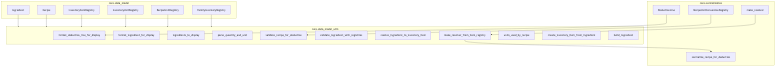

## Architecture: `core/data_model_utils.py`

Integration utilities that sit “between” the data model and higher-level flows.

This module intentionally composes:
- `core.data_model` (entities + registries)
- `core.normalization` (deduction lines + recipe normalization)
- (optionally) taxonomy concepts (but does not require taxonomy to function)

---

## 1. Responsibilities (what this module is for)

### Display formatting (UI-friendly)

- `format_deduction_line_for_display(...)` → `"0.5 kg Leche"`
- `format_ingredient_for_display(...)` → `"250 g Harina"`
- `ingredients_to_display(...)` → list of dicts including unit symbol and optional linked inventory item name

### Validation helpers

- `validate_recipe_for_deduction(...)` → list of human-readable issues (resolution + unit existence checks)
- `validate_ingredient_with_registries(...)` → entity-level checks (name, quantity, unit_id membership)

### Resolution helpers (ingredient → inventory item)

- `resolve_ingredient_to_inventory_item(...)`:
  - prefer `ingredient.inventory_item_id` when present
  - fallback to name-based lookup (`item_registry.get_by_name(ingredient.name)`)
- `make_resolver_from_item_registry(...)`:
  - returns a resolver compatible with `normalize_recipe_for_deduction`

### Convenience builders

- `create_inventory_item_from_ingredient(...)`
- `build_ingredient(...)`
- `units_used_by_recipe(...)` (extract unit ids used by a recipe)

### Parsing (UI → model)

- `parse_quantity_and_unit(...)` (parse strings like `"250 g"` into `(quantity, recipe_unit_id)`)

---

## 2. Public API (functions and data shapes)

### Display helpers

- `format_deduction_line_for_display(line, unit_registry, item_registry) -> str`
  - Example output: `"0.5 kg Leche"`.
  - Fallbacks: if unit/item is missing in registries, it returns a string including raw ids.

- `format_ingredient_for_display(ingredient, recipe_unit_registry) -> str`
  - Example output: `"250 g Harina"`.
  - Fallback: if unit is missing, uses `unit_id`.

- `ingredients_to_display(recipe, recipe_unit_registry, inventory_item_registry=None) -> list[dict]`
  - Each row contains:
    - `name: str`
    - `quantity: float`
    - `unit_symbol: str`
    - `unit_id: int`
    - `inventory_item_name: str | None` (only when `inventory_item_registry` is provided)
  - Linking behavior when `inventory_item_registry` is provided:
    - first try `ingredient.inventory_item_id` (if set)
    - otherwise fallback to `InventoryItemRegistry.get_by_name(ingredient.name)` (name-based linking)

### Parsing

- `parse_quantity_and_unit(quantity_str, unit_registry) -> tuple[float, int]`
  - Parses strings like `"250 g"` into `(250.0, <unit_id>)` by matching unit symbol (case-insensitive).
  - Current behavior: `"250"` (no unit token) raises `ValueError` (unit is required).

### Validation

- `validate_recipe_for_deduction(recipe, item_registry, unit_registry, conversion_table, family_registry) -> list[str]`
  - Returns human-readable issues; empty list means “basic validation passed”.
  - Current checks:
    - ingredient can be resolved to an inventory item (id or name)
    - resolved inventory item’s `stock_unit_id` exists in `InventoryUnitRegistry`
  - Note: current implementation does **not** run full normalization coverage checks; `conversion_table` / `family_registry` are accepted but not used.

- `validate_ingredient_with_registries(ingredient, valid_recipe_unit_ids) -> list[str]`
  - Entity-level checks (name non-empty, quantity finite and > 0, unit_id membership).

### Resolution (for normalization)

- `resolve_ingredient_to_inventory_item(ingredient, item_registry) -> InventoryItem | None`
  - Prefer explicit `ingredient.inventory_item_id` when present and found.
  - Otherwise fallback to name-based lookup (`get_by_name`).

- `make_resolver_from_item_registry(item_registry) -> Callable[[Ingredient], tuple[int, int|None, int]]`
  - Resolver output tuple is `(inventory_item_id, family_id, item_stock_unit_id)`.
  - Designed to plug into `normalize_recipe_for_deduction(..., resolve_ingredient_to_inventory=<resolver>)`.

### Convenience

- `units_used_by_recipe(recipe, recipe_unit_registry, item_registry, inventory_unit_registry) -> tuple[set[int], set[int]]`
  - Returns `(recipe_unit_ids, inventory_unit_ids)` used by a recipe.
  - Note: current implementation does not validate existence against the provided registries; it only extracts ids.

- `create_inventory_item_from_ingredient(ingredient, category_id, stock_unit_id, purchase_unit_id, purchase_to_stock_factor=1.0, family_id=None) -> InventoryItem`
  - Returns `InventoryItem(id=0, ...)` for the caller to persist/add to `InventoryItemRegistry`.

- `build_ingredient(name, quantity, unit_id, inventory_item_id=None) -> Ingredient`

---

## 3. Module dependency picture

```mermaid
flowchart TB
    subgraph dm["core.data_model"]
        Ingredient
        Recipe
        InventoryItemRegistry
        InventoryUnitRegistry
        RecipeUnitRegistry
        FamilyInventoryRegistry
    end

    subgraph norm["core.normalization"]
        DeductionLine
        RecipeUnitConversionRegistry
        normalize_recipe_for_deduction
        make_resolver
    end

    subgraph utils["core.data_model_utils"]
        format_deduction_line_for_display
        format_ingredient_for_display
        ingredients_to_display
        parse_quantity_and_unit
        validate_recipe_for_deduction
        validate_ingredient_with_registries
        resolve_ingredient_to_inventory_item
        make_resolver_from_item_registry
        units_used_by_recipe
        create_inventory_item_from_ingredient
        build_ingredient
    end

    Ingredient --> utils
    Recipe --> utils
    InventoryItemRegistry --> utils
    InventoryUnitRegistry --> utils
    RecipeUnitRegistry --> utils
    FamilyInventoryRegistry --> utils

    DeductionLine --> format_deduction_line_for_display
    RecipeUnitConversionRegistry --> validate_recipe_for_deduction
    make_resolver --> make_resolver_from_item_registry
    make_resolver_from_item_registry --> normalize_recipe_for_deduction
```

---

## 4. Usage patterns (typical)

### Recipe → UI rows (with optional inventory item name)

- Use `ingredients_to_display(recipe, recipe_unit_registry, inventory_item_registry)` when you want:
  - consistent unit symbols for recipe units
  - name-based fallback linking (useful early in onboarding)

### Recipe → deduction lines (normalization)

- Build a resolver with `make_resolver_from_item_registry(item_registry)`
- Then call `normalize_recipe_for_deduction(..., resolve_ingredient_to_inventory=<resolver>, equivalence_registry=...)`

This matches the `core.normalization` contract: resolver returns `(inventory_item_id, family_id, item_unit_id)`.

### Quick validation before attempting normalization

- `validate_recipe_for_deduction(...)` provides a lightweight checklist before attempting normalization.
- For deeper coverage and “readiness” evaluation, use `core.readiness_kpis`.

---

## 5. Relationship to `core/data_model.py`

- Name-based resolution (`InventoryItemRegistry.get_by_name`) is used as a Phase A bootstrap behavior. Once ingredients are explicitly linked (via `inventory_item_id`) and items exist in `InventoryItemRegistry`, resolution becomes stable.
- When inventory items are created from recipe flow, `Recipe.add_ingredient` can return an `InventoryItem(id=0)` for the caller to persist/add to `InventoryItemRegistry`. If a non-standard inventory unit is used, the caller may need to add an item-specific equivalence in `InventoryUnitEquivalenceRegistry` (see `core/data_model.py` docstring on `Recipe.add_ingredient`).

---

## 6. Related docs

- [`architecture-data-model.md`](architecture-data-model.md)
- [`architecture-normalization.md`](architecture-normalization.md)
- [`architecture-readiness-kpis.md`](architecture-readiness-kpis.md)
- [`architecture-taxonomy.md`](architecture-taxonomy.md)

