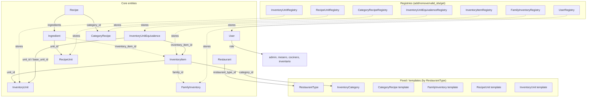
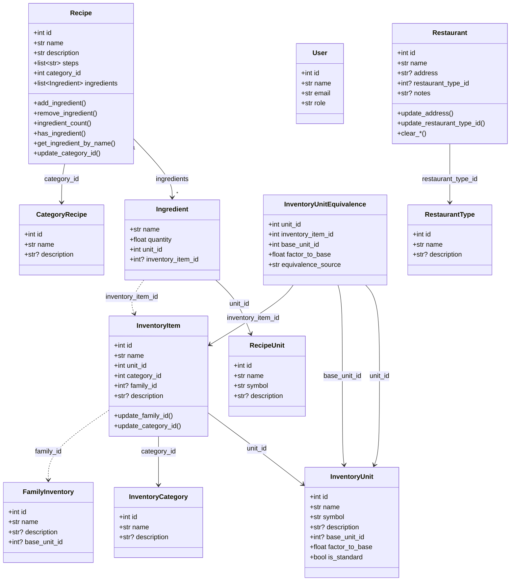
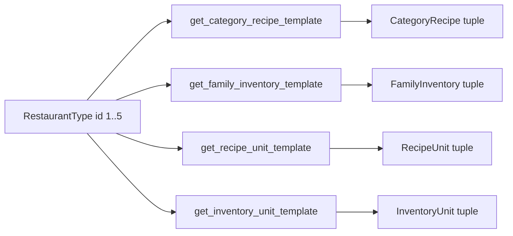
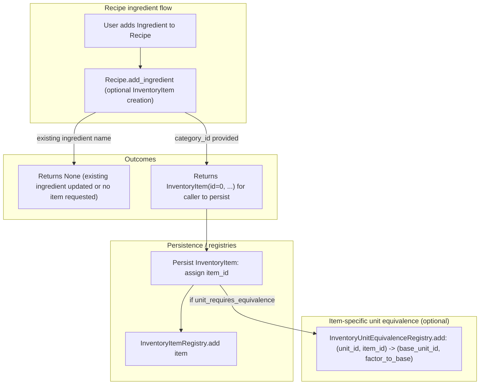
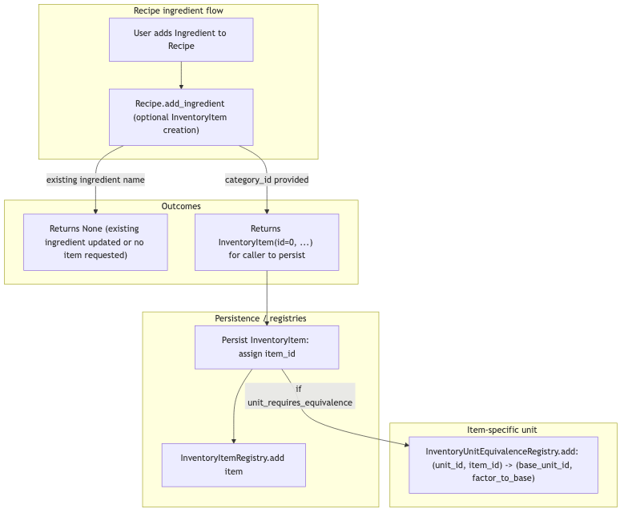

# Architecture: `core/data_model.py`

Core entity classes for recipes, inventory, units, and categories. Defines the foundational data model for Zenet MVP: Restaurant, RestaurantType, User, Recipe, Ingredient, RecipeUnit, InventoryItem, InventoryUnit, FamilyInventory, CategoryRecipe, and InventoryCategory. Includes registries and relationship methods (2.2).

---

## 1. Entity and registry overview




---

## 2. Class diagram




<!-- NOTE: PNG is stale — class diagram Mermaid source updated for Task 10 (InventoryUnitEquivalence unfrozen, equivalence_source added). Regenerate from Mermaid source. -->

---

## 3. Template flow (by `restaurant_type_id`)

Templates are keyed by `RestaurantType` id (1–5). Use the getter functions to obtain default categories, families, and units when setting up a new restaurant.




**Template getters:**

- `get_category_recipe_template(restaurant_type_id)` → `tuple[CategoryRecipe, ...]`
- `get_family_inventory_template(restaurant_type_id)` → `tuple[FamilyInventory, ...]`
- `get_recipe_unit_template(restaurant_type_id)` → `tuple[RecipeUnit, ...]`
- `get_inventory_unit_template(restaurant_type_id)` → `tuple[InventoryUnit, ...]`

Template behavior:

- Template items use `id=0`; assign real ids when adding to a registry.
- If `restaurant_type_id` is invalid (not in `DEFAULT_RESTAURANT_TYPES`), each getter returns an **empty tuple**.

---

## 4. Note on `restaurant_description` (Task 17)

`restaurant_description` is **not** a field on the `Restaurant` dataclass and is **not** a
column on the `restaurant` SQLite table. It is stored in the `classification` entity's JSON
`data` blob alongside `standardization_level`.

**Why:** The `restaurant` table uses typed SQLite columns (see `core/storage/schema.py`).
Adding a new column requires a schema migration. The `classification` entity uses a generic
JSON blob — any keys can be added without touching the schema.

**Where to find it:**
- Stored by: `_make_confirm_fn` in `gradio_app/sections/clasificacion.py`
- Loaded by: `_load_configuration_context` in `gradio_app/sections/configuracion.py`
- Full entity schema: see `docs/Architecture/sections/clasificacion.md` Section 5

---

## 5. Fixed data (no registries)

- **RestaurantType:** `DEFAULT_RESTAURANT_TYPES` (Casual, Rápida, Gourmet, Cafeterías, Cafés). User selects only.
- **InventoryCategory:** `DEFAULT_INVENTORY_CATEGORIES` (Perecedero, No perecedero). User selects only.

Validation helpers: `_valid_restaurant_type_ids()`, `_valid_inventory_category_ids()`.

---

## 5. Registry summary

| Registry | Stores | Key behavior |
|----------|--------|--------------|
| `RecipeUnitRegistry` | `RecipeUnit` | add/remove, `valid_ids()`, `get()`. Remove guarded by optional ingredient list. |
| `InventoryUnitRegistry` | `InventoryUnit` | add/remove (cycle check on base_unit_id chain), `valid_ids()`, `get()`. Remove guarded by optional inventory items. |
| `InventoryUnitEquivalenceRegistry` | `InventoryUnitEquivalence` | add/get/remove keyed by `(unit_id, inventory_item_id)`; validates referenced units using `InventoryUnitRegistry`. |
| `CategoryRecipeRegistry` | `CategoryRecipe` | add/update/remove, `valid_ids()`, `get()`. Remove guarded by optional recipes. |
| `FamilyInventoryRegistry` | `FamilyInventory` | add/remove, `valid_ids()`, `get()`. Remove guarded by optional inventory items. |
| `InventoryItemRegistry` | `InventoryItem` | add/remove/get/get_by_name/list_all/valid_ids; enforces unique item name (case-insensitive). |
| `UserRegistry` | `User` | add/update/delete require `current_user.role == "admin"`; `get()`. |

Roles for `User`: `ALLOWED_USER_ROLES = {"admin", "mesero", "cocinero", "inventario"}`.

---

## 6. Key workflows & invariants (how the model is intended to be used)

### Inventory units: `is_standard` and item-specific equivalences

`InventoryUnit.is_standard` distinguishes:

- **Standard units** (e.g. `kg`, `g`, `L`, `ml`, `pza`): conversions can be expressed via a unit chain (`base_unit_id` + `factor_to_base`) and are generally global.
- **Non-standard / contextual units** (e.g. `caja`, `bolsa`, `bote`, `pkg`, `bot`): conversions can be **item-specific** (1 caja of strawberries ≠ 1 caja of oranges).

For contextual units, the intended mechanism is `InventoryUnitEquivalenceRegistry`, keyed by:

- `(unit_id, inventory_item_id) -> (base_unit_id, factor_to_base)`

This enables normalization to convert quantities for a specific item when the unit is contextual.

### Recipe → Ingredient → (optional) InventoryItem creation

`Recipe.add_ingredient(...)` can be used in two ways:

- **Ingredient-only:** add the ingredient to the recipe (no inventory item created).
- **Ingredient + inventory creation:** if `category_id` is provided, `add_ingredient` returns a new `InventoryItem(id=0, ...)` for the caller to persist/add to `InventoryItemRegistry`.

If the inventory unit is contextual and requires a conversion, callers set `unit_requires_equivalence=True` and then, **after persisting** the item and obtaining a real id, add an equivalence entry.





### Registry invariants (high-signal)

- `InventoryUnitRegistry.add(...)`:
  - if `base_unit_id` is set, it must already exist in the registry
  - cycles in the `base_unit_id` chain are rejected
- `InventoryItemRegistry.add(...)`:
  - enforces unique item name (case-insensitive)
  - `get_by_name(...)` supports name-based resolution in early onboarding flows

---

## 7. Task 10 additions (Alineamiento)

### Standard recipe unit constant

```python
STANDARD_RECIPE_UNIT_SYMBOLS: frozenset[str] = frozenset({"g", "kg", "ml", "L", "pza"})

def is_standard_recipe_unit(symbol: str) -> bool:
    """Return True if the symbol is a standard recipe unit (no equivalent needed)."""
    return symbol in STANDARD_RECIPE_UNIT_SYMBOLS
```

Standard units need no per-ingredient mass equivalent. Any other symbol (taza, cda, cdta,
oz, manojo, pizca, etc.) is non-standard and requires an equivalent proposed per-ingredient
by `AlignmentAgent`.

### InventoryUnitEquivalence — unfrozen + equivalence_source

`InventoryUnitEquivalence` was `@dataclass(frozen=True)` prior to Task 10. Task 10
removed `frozen=True` to allow future updates by Task 11, and added:

| Field | Type | Default | Meaning |
|-------|------|---------|---------|
| `equivalence_source` | `str` | `"operator"` | `"operator"` / `"agent_confirmed"` / `"agent_estimated"` |

### RecipeUnitConversionEntry.source

`RecipeUnitConversionEntry` (in `core/operations/normalization.py`) received a new field:

| Field | Type | Default | Meaning |
|-------|------|---------|---------|
| `source` | `str` | `"agent_estimated"` | `"operator"` / `"agent_confirmed"` / `"agent_estimated"` |

Source values:
- `"operator"` — operator explicitly provided or corrected the equivalent
- `"agent_confirmed"` — operator accepted the agent's culinary estimate as-is
- `"agent_estimated"` — operator skipped; agent estimate stored without confirmation

---

## Related docs

- [`architecture-normalization.md`](architecture-normalization.md)
- [`architecture-taxonomy.md`](architecture-taxonomy.md)
- [`architecture-data-model-utils.md`](architecture-data-model-utils.md)
- [`architecture-readiness-kpis.md`](architecture-readiness-kpis.md)
