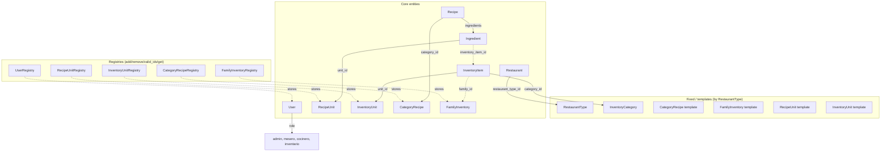
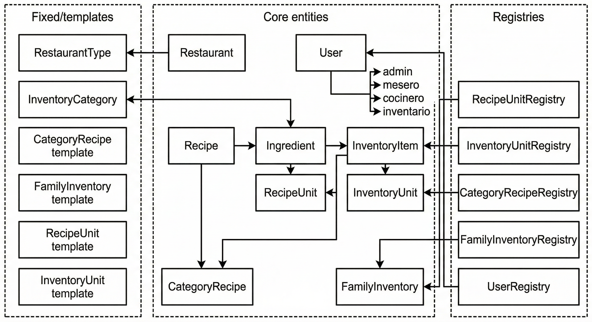
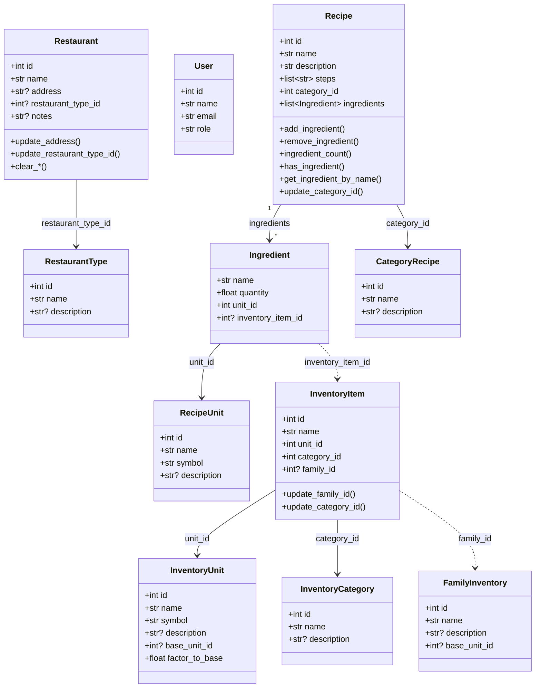
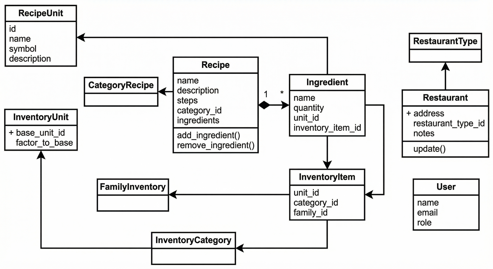
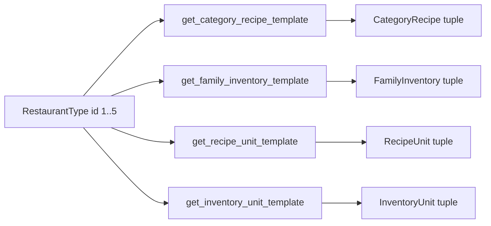
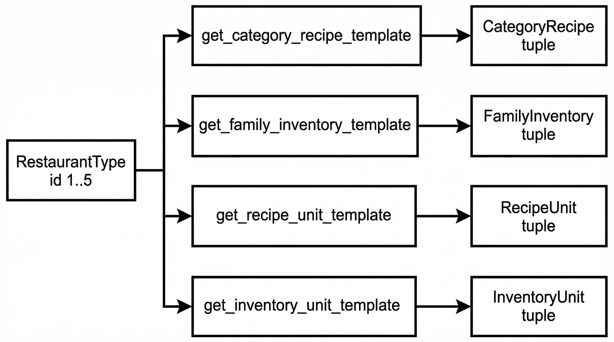

# Architecture: `core/data_model.py`

Core entity classes for recipes, inventory, units, and categories. Defines the foundational data model for Zenet MVP: Restaurant, RestaurantType, User, Recipe, Ingredient, RecipeUnit, InventoryItem, InventoryUnit, FamilyInventory, CategoryRecipe, and InventoryCategory. Includes registries and relationship methods (2.2).

---

## 1. Entity and registry overview

---

## 2. Class diagram

---

## 3. Template flow (by `restaurant_type_id`)

Templates are keyed by `RestaurantType` id (1–5). Use the getter functions to obtain default categories, families, and units when setting up a new restaurant.

**Template getters:**

- `get_category_recipe_template(restaurant_type_id)` → `tuple[CategoryRecipe, ...]`
- `get_family_inventory_template(restaurant_type_id)` → `tuple[FamilyInventory, ...]`
- `get_recipe_unit_template(restaurant_type_id)` → `tuple[RecipeUnit, ...]`
- `get_inventory_unit_template(restaurant_type_id)` → `tuple[InventoryUnit, ...]`

Template items use `id=0`; assign real ids when adding to a registry.

---

## 4. Fixed data (no registries)

- **RestaurantType:** `DEFAULT_RESTAURANT_TYPES` (Casual, Rápida, Gourmet, Cafeterías, Cafés). User selects only.
- **InventoryCategory:** `DEFAULT_INVENTORY_CATEGORIES` (Perecedero, No perecedero). User selects only.

Validation helpers: `_valid_restaurant_type_ids()`, `_valid_inventory_category_ids()`.

---

## 5. Registry summary

| Registry | Stores | Key behavior |
|----------|--------|--------------|
| `RecipeUnitRegistry` | `RecipeUnit` | add/remove, `valid_ids()`, `get()`. Remove guarded by optional ingredient list. |
| `InventoryUnitRegistry` | `InventoryUnit` | add/remove (cycle check on base_unit_id chain), `valid_ids()`, `get()`. Remove guarded by optional inventory items. |
| `CategoryRecipeRegistry` | `CategoryRecipe` | add/update/remove, `valid_ids()`, `get()`. Remove guarded by optional recipes. |
| `FamilyInventoryRegistry` | `FamilyInventory` | add/remove, `valid_ids()`, `get()`. Remove guarded by optional inventory items. |
| `UserRegistry` | `User` | add/update/delete require `current_user.role == "admin"`; `get()`. |

Roles for `User`: `ALLOWED_USER_ROLES = {"admin", "mesero", "cocinero", "inventario"}`.
