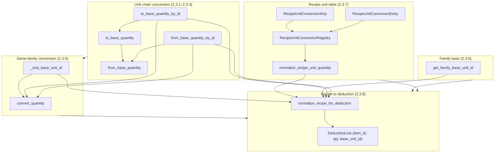
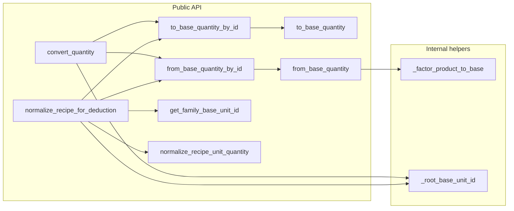
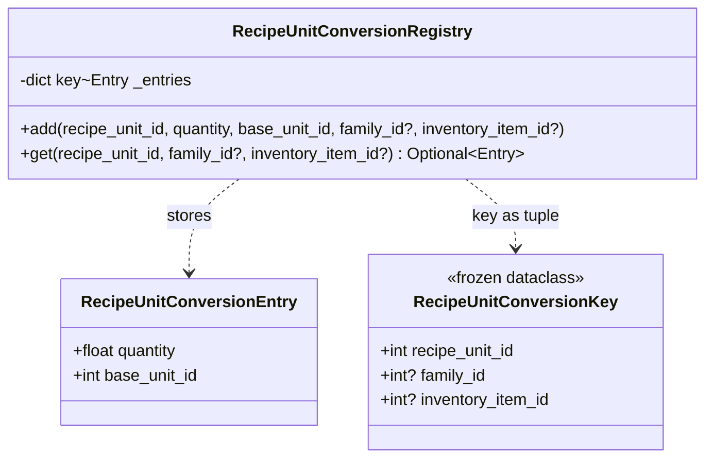
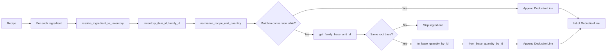
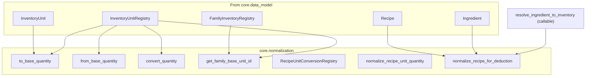

# Architecture: `core/normalization.py`

Unit conversion and normalization for inventory deduction (subtask 2.3). Provides: `to_base_quantity` / `from_base_quantity` for InventoryUnit chains; family base unit resolution; recipe-unit conversion table application; normalized recipe (list per recipe for deduction on order).

---

## 1. High-level flow (layers)

---

## 2. Function dependency graph

---

## 3. Recipe-unit conversion types (2.3.7)

---

## 4. Recipe to deduction flow (2.3.8)

### Recipe unit vs inventory unit (same vs different dimension)

Deduction is always in the **inventory item's unit**. How we get there depends on whether the recipe unit and item unit are in the same dimension:

- **Same dimension** (e.g. recipe "2 cajas", item in kg): The fallback path converts via the unit chain and optional item-specific equivalence (e.g. 1 caja = 5 kg). No conversion table entry is required.
- **Different dimension** (e.g. recipe "1 tortilla" in pza, item stored in kg): The unit chain cannot convert pza to kg (different roots). A **recipe-unit conversion table** entry is required (e.g. "1 pza = 0.05 kg" for that item). Without it, the ingredient is skipped and no deduction line is produced.

---

## 5. External dependencies

Imports from `core.data_model`: `FamilyInventoryRegistry`, `Ingredient`, `InventoryUnit`, `InventoryUnitRegistry`, `Recipe`.

---

## 6. Section summary

| Section | Responsibility |
|--------|----------------|
| **2.3.1–2.3.3** | Convert quantity along an `InventoryUnit` chain: `to_base_quantity` / `from_base_quantity` (and by-id wrappers). |
| **2.3.5** | `convert_quantity`: convert between two units that share the same root base (`_root_base_unit_id`). |
| **2.3.6** | `get_family_base_unit_id`: family’s deduction base unit from `FamilyInventoryRegistry` + `InventoryUnitRegistry`. |
| **2.3.7** | Recipe-unit conversion: `RecipeUnitConversionKey`, `RecipeUnitConversionEntry`, `RecipeUnitConversionRegistry`, and `normalize_recipe_unit_quantity` (recipe units → normalized quantity + base_unit_id). |
| **2.3.8** | `normalize_recipe_for_deduction`: for each ingredient, resolve to inventory + family, normalize (table or family-base fallback), output `list[DeductionLine]` (inventory_item_id, normalized_quantity, base_unit_id). |

**Type alias:** `DeductionLine = tuple[int, float, int]` — (inventory_item_id, normalized_quantity, base_unit_id).
