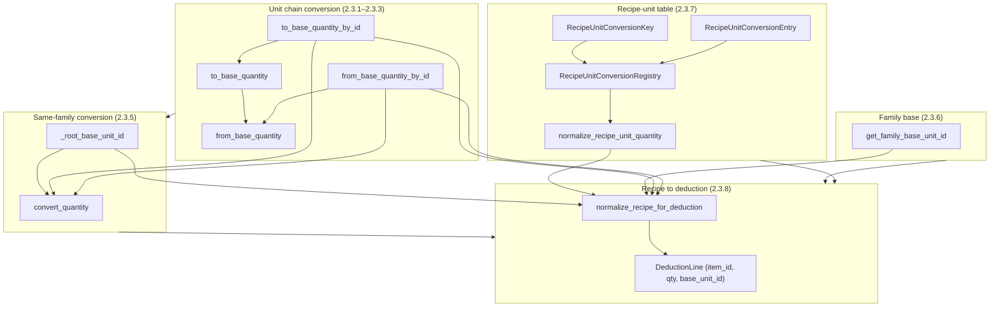
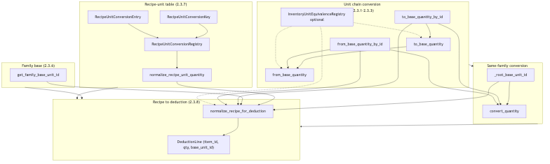
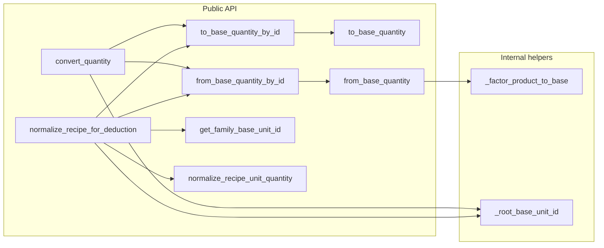
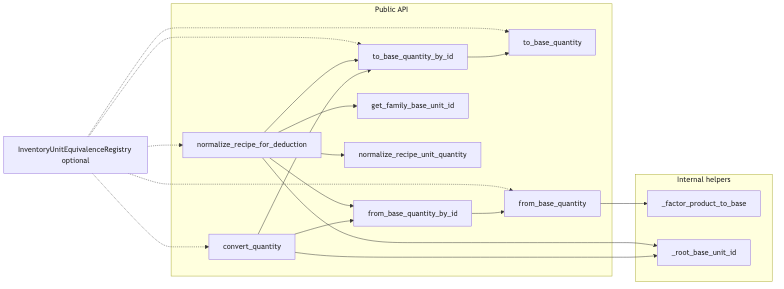
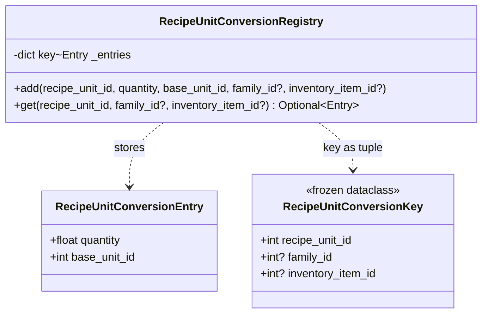
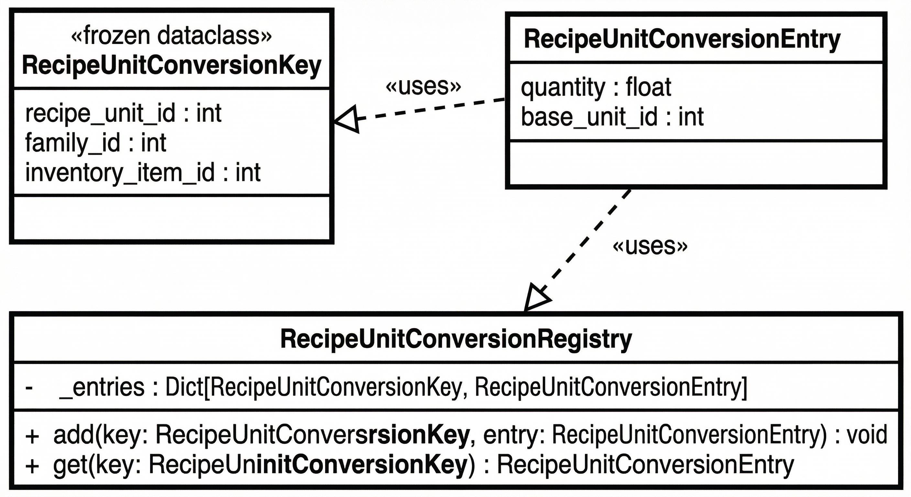
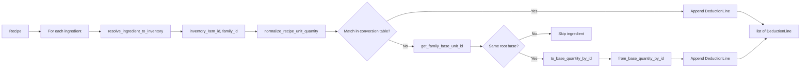
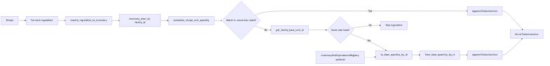
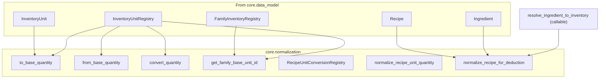
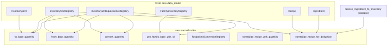

# Architecture: `core/normalization.py`

Unit conversion and normalization for inventory deduction (subtask 2.3). Provides: `to_base_quantity` / `from_base_quantity` for InventoryUnit chains; family base unit resolution; recipe-unit conversion table application; normalized recipe (list per recipe for deduction on order).

---

## 1. High-level flow (layers)

---

## 2. Function dependency graph

---

## 3. Recipe-unit conversion types (2.3.7)

**Important:** `RecipeUnitConversionKey` is a frozen dataclass defined in the code for clarity, but the **public API** (`RecipeUnitConversionRegistry.add/get`) uses plain `int` and `Optional[int]` parameters. Internally, keys are stored as `tuple[int, Optional[int], Optional[int]]`.

**Search priority for `get(...)`:**

When looking up a conversion, the registry tries keys in this order (returns first match):

1. `(recipe_unit_id, family_id, inventory_item_id)` — most specific (item-level)
2. `(recipe_unit_id, family_id, None)` — family-level
3. `(recipe_unit_id, None, inventory_item_id)` — item-level without family
4. `(recipe_unit_id, None, None)` — global (any family/item)

This allows item-specific conversions to override family-level or global defaults.

---

## 4. Recipe to deduction flow (2.3.8)

### Recipe unit vs inventory unit (same vs different dimension)

Deduction is always in the **inventory item's unit**. How we get there depends on whether the recipe unit and item unit are in the same dimension:

- **Same dimension** (e.g. recipe "2 cajas", item in kg): The fallback path converts via the unit chain and optional item-specific equivalence (e.g. 1 caja = 5 kg). No conversion table entry is required.
- **Different dimension** (e.g. recipe "1 tortilla" in pza, item stored in kg): The unit chain cannot convert pza to kg (different roots). A **recipe-unit conversion table** entry is required (e.g. "1 pza = 0.05 kg" for that item). Without it, the ingredient is skipped and no deduction line is produced.

---

## 5. External dependencies

Imports from `core.data_model`: `FamilyInventoryRegistry`, `Ingredient`, `InventoryUnit`, `InventoryUnitRegistry`, `Recipe`.

---

## 6. Section summary

| Section | Responsibility |
|--------|----------------|
| **2.3.1–2.3.3** | Convert quantity along an `InventoryUnit` chain: `to_base_quantity` / `from_base_quantity` (and by-id wrappers). |
| **2.3.5** | `convert_quantity`: convert between two units that share the same root base (`_root_base_unit_id`). |
| **2.3.6** | `get_family_base_unit_id`: family’s deduction base unit from `FamilyInventoryRegistry` + `InventoryUnitRegistry`. |
| **2.3.7** | Recipe-unit conversion: `RecipeUnitConversionKey`, `RecipeUnitConversionEntry`, `RecipeUnitConversionRegistry`, and `normalize_recipe_unit_quantity` (recipe units → normalized quantity + base_unit_id). |
| **2.3.8** | `normalize_recipe_for_deduction`: for each ingredient, resolve to inventory + family, normalize (table or family-base fallback), output `list[DeductionLine]` (inventory_item_id, normalized_quantity, base_unit_id). |

**Type alias:** `DeductionLine = tuple[int, float, int]` — (inventory_item_id, normalized_quantity, base_unit_id).

---

## 7. Public API (functions and return shapes)

### Unit chain conversion

- `to_base_quantity(quantity, unit, registry) -> float`
  - Converts `quantity` from `unit` to its root base unit via the `base_unit_id` chain.

- `from_base_quantity(base_quantity, unit, registry) -> float`
  - Inverse of `to_base_quantity`: converts a quantity expressed in the base (root) into the given `unit`.

- `to_base_quantity_by_id(quantity, unit_id, registry) -> float`
  - Looks up `unit` by `unit_id` and calls `to_base_quantity`.

- `from_base_quantity_by_id(base_quantity, unit_id, registry) -> float`
  - Looks up `unit` by `unit_id` and calls `from_base_quantity`.

### Same-dimension conversion

- `convert_quantity(quantity, from_unit_id, to_unit_id, registry) -> float`
  - Converts between two units that share the same root base (e.g., `g` ↔ `kg`).
  - Raises `ValueError` if the units have different root bases (different dimensions).

### Family base unit

- `get_family_base_unit_id(family_id, family_registry, unit_registry) -> int | None`
  - Returns the `base_unit_id` for a family (from `FamilyInventory.base_unit_id`), or `None` if not set.
  - Note: Phase A deduction uses **per-item units** (not a single family-wide base), so this is currently optional/informational.

### Recipe-unit conversion

- `normalize_recipe_unit_quantity(quantity, recipe_unit_id, family_id, inventory_item_id, conversion_table, unit_registry) -> tuple[float, int]`
  - Returns `(normalized_quantity, base_unit_id)` after looking up the best match in `conversion_table`.
  - Semantics: assumes table entry represents "1 recipe unit = entry.quantity base_unit", so returned quantity is `quantity * entry.quantity`.

### Normalized recipe for deduction

- `normalize_recipe_for_deduction(recipe, family_registry, unit_registry, conversion_table, resolve_ingredient_to_inventory) -> list[DeductionLine]`
  - Returns a list of `(inventory_item_id, normalized_quantity, unit_id)` where each line is **expressed in the inventory item's own `stock_unit_id`** (always a standard unit).
  - `resolve_ingredient_to_inventory: Callable[[Ingredient], tuple[int, int|None, int]]` must return `(inventory_item_id, family_id, item_stock_unit_id)`.
  - Ingredients that cannot be normalized are **skipped** (no exception; just omitted from the result).

### Resolver factory and deduction application

- `make_resolver(get_item: Callable[[Ingredient], InventoryItem | None]) -> Callable[[Ingredient], tuple[int, int|None, int]]`
  - Builds a resolver for `normalize_recipe_for_deduction` from a simpler lookup function.
  - If `get_item(ing)` returns `None`, the resolver raises `ValueError` and the ingredient is skipped.

- `apply_deduction_lines(lines: list[DeductionLine], on_deduct: Callable[[int, float, int], None]) -> None`
  - Helper to apply deduction lines by calling `on_deduct(inventory_item_id, quantity, unit_id)` for each line.
  - The `on_deduct` callback is responsible for persisting the deduction (e.g., subtract from stock).

---

## 8. Concrete examples

### Example 1: Same dimension (caja → kg, via unit chain + purchase factor)

Setup:
- Recipe ingredient: `2 cajas` of strawberries
- Inventory item: strawberries with `stock_unit=kg`, `purchase_unit=caja`, `purchase_to_stock_factor=2.0` (1 caja = 2 kg)
- Inventory units: `kg` (root), `caja` (contextual, `is_standard=False`)

Flow:
- Resolve ingredient → `inventory_item_id=strawberries`, `item_stock_unit_id=kg`
- No conversion table entry needed (same dimension: both `caja` and `kg` are in the mass family)
- Fallback path: `to_base_quantity_by_id(2.0, caja, registry)` resolves via the standard `kg` chain — non-standard units without a `base_unit_id` chain pass through unchanged; the caller applies `purchase_to_stock_factor` from the `InventoryItem` directly (factor=2.0) → `4.0 kg`
- Result: `DeductionLine = (strawberries, 4.0, kg)`

### Example 2: Different dimension (tortilla → kg, requires table entry)

Setup:
- Recipe ingredient: `3 pza` tortillas
- Inventory item: tortillas stored in `kg`
- Inventory units: `kg` (root for mass), `pza` (root for count) — **different dimensions**
- No unit chain can convert `pza` to `kg`
- Conversion table entry: `(recipe_unit_id=pza, inventory_item_id=tortillas) -> (quantity=0.05, base_unit_id=kg)` (1 tortilla = 0.05 kg)

Flow:
- Resolve ingredient → `inventory_item_id=tortillas`, `item_unit_id=kg`
- `normalize_recipe_unit_quantity(3.0, pza, None, tortillas, conversion_table, ...)` finds the table entry → `(3.0 * 0.05, kg)` = `(0.15, kg)`
- `convert_quantity(0.15, kg, kg, ...)` → `0.15` (already in target unit)
- Result: `DeductionLine = (tortillas, 0.15, kg)`

If the conversion table entry is **missing**, the ingredient is **skipped** (fallback path checks root bases: `pza` root ≠ `kg` root → incompatible → skip).

---

## Related docs

- [`architecture-data-model.md`](architecture-data-model.md)
- [`architecture-taxonomy.md`](architecture-taxonomy.md)
- [`architecture-data-model-utils.md`](architecture-data-model-utils.md)
- [`architecture-readiness-kpis.md`](architecture-readiness-kpis.md)
