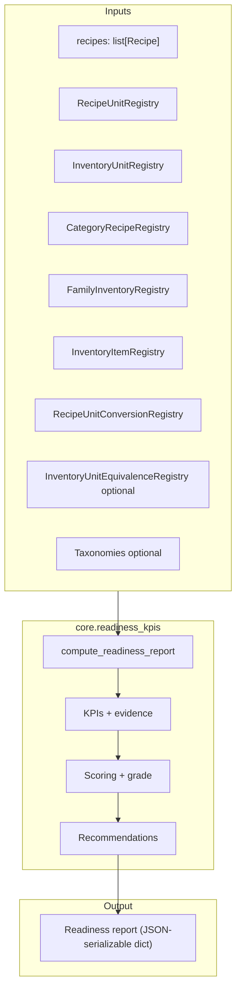

## Architecture: `core/readiness_kpis.py`

Readiness KPIs are an onboarding completeness & standardization scorecard.

Phase A is **readiness-only** (no operational/performance KPIs). The system produces a deterministic,
JSON-serializable report from the in-memory model (registries + recipes + normalization).

---

## 1. Public API

- `compute_readiness_report(...) -> dict[str, Any]`

Inputs include:
- `recipes: list[Recipe]`
- registries: recipe units, inventory units, categories, families, items
- normalization conversion table + optional item equivalences
- optional taxonomies (ingredient/inventory/recipe)

Output is a report with:
- `schema_version`
- `meta` (counts + timestamp)
- `overall` (score + grade + status)
- `dimensions[]` (setup, recipes, inventory, normalization, taxonomy)
- `recommendations[]` (Top fixes)

---

## 2. Dataflow (high-level)



---

## 3. Output schema (what `compute_readiness_report` returns)

Top-level keys:

- `schema_version: str` (currently `"1.0"`)
- `generated_at: str` (UTC ISO string, `...Z`)
- `restaurant?: { restaurant_id: int, name: str, restaurant_type_id: int | None }`
  - **Important:** if `restaurant` input is `None`, the `restaurant` key is **omitted** from the report (not present with `null`).
- `overall: { score_0_100: float, grade: "A"|"B"|"C"|"D", status: "ok"|"warn"|"fail" }`
- `dimensions: list[ { dimension_id, title, weight, score_0_100, status, kpis } ]`
- `kpis: list[ KPI ]` (flat list across all dimensions, with per-KPI weights assigned)
- `recommendations: list[ Recommendation ]`
- `meta: { counts: { recipes: int, ingredients: int, inventory_items: int } }`

Minimal shape:

```json
{
  "schema_version": "1.0",
  "generated_at": "2026-02-19T00:00:00Z",
  "restaurant": { "restaurant_id": 1, "name": "Demo", "restaurant_type_id": 2 },
  "overall": { "score_0_100": 85.0, "grade": "B", "status": "warn" },
  "dimensions": [],
  "kpis": [],
  "recommendations": [],
  "meta": { "counts": { "recipes": 0, "ingredients": 0, "inventory_items": 0 } }
}
```

---

## 4. KPI object shape

Each KPI is a dict with (at minimum):

- `kpi_id: str`
- `dimension_id: str`
- `title: str`
- `description: str`
- `kind: "count" | "ratio"`
- `value: int | float | null`
- `unit: "count" | "percent_0_1"`
- `target: {...}` (varies by kind)
- `status: "ok" | "warn" | "fail" | "na"`
- `severity: "low" | "medium" | "high"`
- `evidence: { ... }` (optional; typically includes `sample_missing: list[{entity_type, ref, reason}]`)
- `remediation: { summary: str, next_actions: list[str] }` (optional)

Additional numeric fields used for ratio KPIs:

- `numerator: int`
- `denominator: int`

Notes:

- If a ratio KPI has `denominator <= 0` (or is explicitly forced NA), it returns `value=null` and `status="na"` so it does not affect scoring.

---

## 5. Scoring (Phase A defaults)

### Dimension weights (locked)

- setup: 0.20
- recipes: 0.25
- inventory: 0.20
- normalization: 0.30
- taxonomy: 0.00

### Score bands

- `score >= 90` → `status="ok"` and `grade="A"` (grade thresholds: A/B/C/D)
- `70 <= score < 90` → `status="warn"`
- `score < 70` → `status="fail"`

### “Truth” KPIs (highest impact)

These are treated as highest leverage in recommendation generation:

- `recipes.ingredientsLinkedToInventoryPct` targets: ok ≥ 0.95, warn ≥ 0.80
- `normalization.deductionCoveragePct` targets: ok ≥ 0.90, warn ≥ 0.70

---

## 6. Recommendations

Recommendations are generated from warn/fail KPIs, with “truth” KPIs prioritized.

Each recommendation includes:

- `recommendation_id: str` (e.g. `"rec.linkIngredientsToInventory"`)
- `priority: "high" | "medium" | "low"`
- `title: str`
- `summary: str`
- `next_actions: list[str]`
- `related_kpis: list[str]`

Sorting:

- Primarily by `priority` (high → medium → low), then by `recommendation_id`.

---

## 7. Phase A notes (behavior)

- **Ingredient “linked to inventory”** is satisfied by:
  - explicit `ingredient.inventory_item_id`, or
  - name-based lookup in `InventoryItemRegistry` (Phase A bootstrap behavior)
- Enrichment-only KPIs (e.g. taxonomy in Phase A) are emitted as `status="na"` so they **do not affect scores**.

---

## 4. Related docs

- [`architecture-data-model.md`](architecture-data-model.md)
- [`architecture-normalization.md`](architecture-normalization.md)
- [`architecture-data-model-utils.md`](architecture-data-model-utils.md)
- `.taskmaster/docs/subtask-2.7-plan.md` (full KPI spec)
- `.taskmaster/docs/readiness-scorecard-ux.md` (UX copy/layout)

