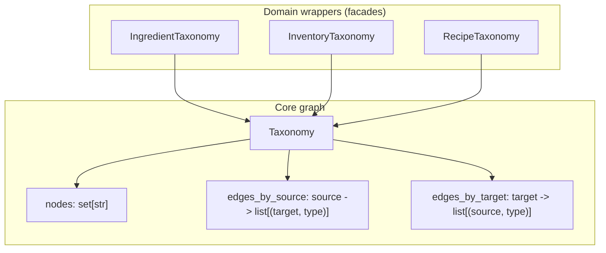

## Architecture: `core/taxonomy.py`

Semantic relations and taxonomies for ingredients, recipes, and inventory.

This is a **separate semantic layer** from the core data model. Node ids are strings and may be:
- names (e.g. `"tomate"`, `"verdura"`)
- stringified ids (e.g. `"123"`)

The caller is responsible for populating the taxonomy and keeping it in sync with the data model.

---

## 1. Concepts

### Relationship types

- **`is_a`**: subtype / classification. Stored as `(child, parent)`.
- **`part_of`**: meronymy. Stored as `(part, whole)`.

### Directionality (important)

The taxonomy uses **directed edges**:
- `is_a(child, parent)` means `child → parent`
- `part_of(part, whole)` means `part → whole`

---

## 2. Public API (what exists in `core/taxonomy.py`)

### Core graph: `Taxonomy`

`Taxonomy` is a small, in-memory directed graph with:

- `nodes: set[str]`
- edge list plus two adjacency maps:
  - `edges_by_source: source -> [(target, relationship_type)]`
  - `edges_by_target: target -> [(source, relationship_type)]`

Public methods:

- `add_node(node_id: str, name: str | None = None) -> None`
  - Note: `name` is accepted for convenience but is not persisted separately today; `node_id` is the canonical key.

- `add_relationship(source: str, target: str, relationship_type: str = IS_A) -> None`
  - Adds a directed edge (for `is_a`, `source=child`, `target=parent`).

- `get_children(node_id: str) -> list[str]`
  - Returns **incoming** neighbors (sources that point to `node_id`).
  - For `is_a(child, parent)`, this corresponds to “children of a parent”.

- `get_parents(node_id: str) -> list[str]`
  - Returns **outgoing** neighbors (targets pointed to by `node_id`).
  - For `is_a(child, parent)`, this corresponds to “parents of a child”.

- `get_related(node_id: str, relationship_type: str) -> list[str]`
  - Returns a **union** of:
    - outgoing targets of this relationship type
    - incoming sources of this relationship type
  - Practical effect: results are symmetric (you get “related” nodes regardless of direction).

- `has_relationship(a: str, b: str, relationship_type: str) -> bool`
  - True if there exists an edge `(a -> b, type)` **or** `(b -> a, type)`.

- `has_node(node_id: str) -> bool`

### Traversal helper: `find_related_items`

`find_related_items(taxonomy, node_id, max_depth=None, limit=None) -> list[tuple[str, int]]`

- Breadth-first traversal (BFS) over **both** `get_children(n) + get_parents(n)`
- Does **not** filter by relationship type; it treats the graph as undirected for traversal purposes.
- Returns `(node_id, distance)` pairs where:
  - `distance=0` is the start node itself
  - `distance=1` are direct neighbors (parent or child)
- Sorted by `(distance, node_id)`, with optional `limit`.

### Domain wrappers (facades)

These wrap an internal `Taxonomy` instance and expose domain-named methods:

- `IngredientTaxonomy`
  - `add_ingredient`, `add_is_a`, `add_part_of`, `get_ingredient_ancestors`, `get_ingredient_related`
  - `.taxonomy` property (access underlying `Taxonomy`)

- `RecipeTaxonomy`
  - `add_recipe`, `add_is_a`, `add_part_of`, `get_recipe_categories`, `get_related_recipes`
  - `.taxonomy` property

- `InventoryTaxonomy`
  - `add_item`, `add_is_a`, `add_part_of`, `get_inventory_ancestors`, `get_related_inventory_items`
  - `.taxonomy` property

---

## 3. High-level structure

`Taxonomy` is the generic graph container. Domain-specific wrappers provide a narrower surface:

- `IngredientTaxonomy`
- `InventoryTaxonomy`
- `RecipeTaxonomy`

---

## 4. Traversal helper (example)

`find_related_items(taxonomy, node_id, max_depth?, limit?)` performs a BFS traversal and returns:

- `list[tuple[node_id, distance]]`
- `distance=0` for the start node
- sorted by `(distance, node_id)` with optional `limit`

---

## 5. Practical notes / gotchas

- **Relationship direction matters** for `get_children` vs `get_parents`, but **`get_related` intentionally ignores direction** (it unions in+out for that type).
- **Traversal ignores edge type**: `find_related_items` walks parents+children regardless of whether an edge is `is_a` or `part_of`.
- This module does not enforce any constraints like acyclicity or single parent; callers can model DAGs or even cyclic graphs (cycles will not crash BFS due to `seen` tracking, but they may not be semantically meaningful).

---

## 6. Related docs

- [`architecture-data-model.md`](architecture-data-model.md)
- [`architecture-normalization.md`](architecture-normalization.md)
- [`architecture-readiness-kpis.md`](architecture-readiness-kpis.md)
- [`architecture-data-model-utils.md`](architecture-data-model-utils.md)

